# Visual divergence sheet — certified-app

**Branch:** `feat/positioning-redesign` · **Date:** 2026-05-28 · **Companion to** [`component-audit.md`](./component-audit.md).

Each section below shows the canonical primitive (green border) **next to** every divergent implementation in the codebase (amber border) for the same UI job. Composite source: [`divergence-sheet.html`](./divergence-sheet.html) — a self-contained HTML file with inlined tokens + verbatim divergent class CSS, captured at 1440×900 in both themes.

| | Light | Dark |
| --- | --- | --- |
| **Full sheet** | [`divergence/_full_light.png`](./divergence/_full_light.png) | [`divergence/_full_dark.png`](./divergence/_full_dark.png) |

---

## § 1 · Buttons — 12 vocabularies, one canonical primitive

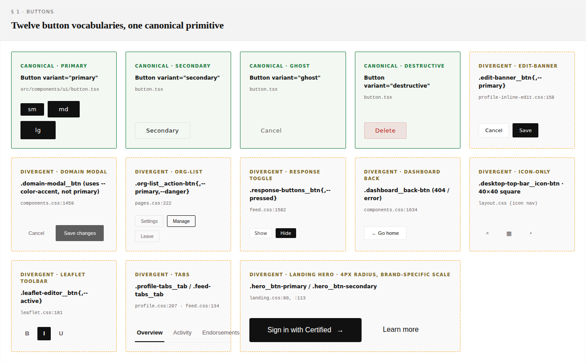
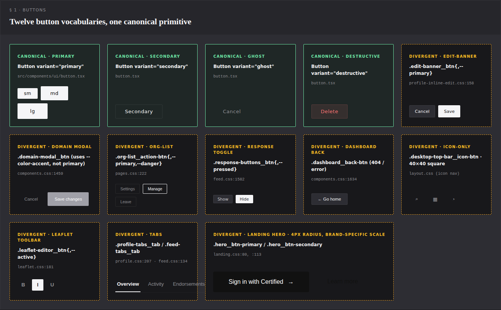

The canonical Button (`src/components/ui/button.tsx`) covers four variants × three sizes — that's the green column on the left. Everything in amber is a hand-rolled CSS-class implementation living somewhere else.

The dark-theme capture makes one finding visceral: **the landing hero button doesn't invert in dark mode** (it forces invariant black-on-light because `landing.css` uses the invariant `--color-primary` token). On the dark divergence sheet you can see it sitting as a white-on-dark island that doesn't match the surrounding buttons. That's the "Landing palette kept invariant" rule from `tokens.css:42–46` doing exactly what it's supposed to — but it's a visual choice that the rest of the app doesn't make, and the audit's recommendation to **force landing always-light** ([component-audit.md §7 Tier 1 #3](./component-audit.md#tier-1--high-leverage-low-risk-single-commit-fixes)) would resolve this.

**Maps to decision queue:** B1 (icon-only variant), B2 (accent variant), B3 (tabs), B4 (landing).

---

## § 2 · Inputs — 6 shapes, no size system

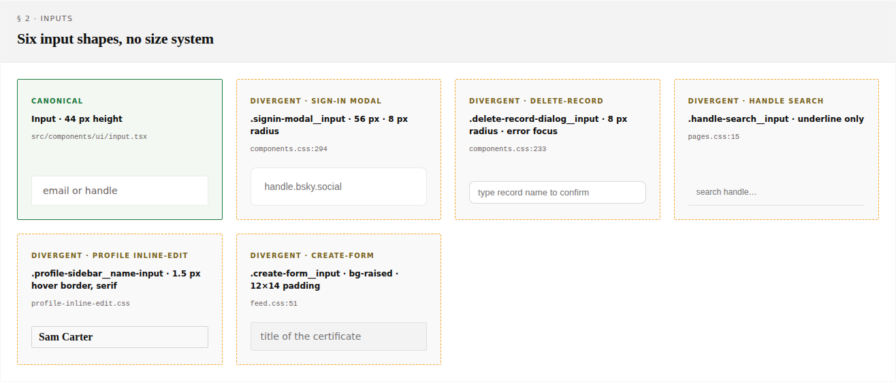
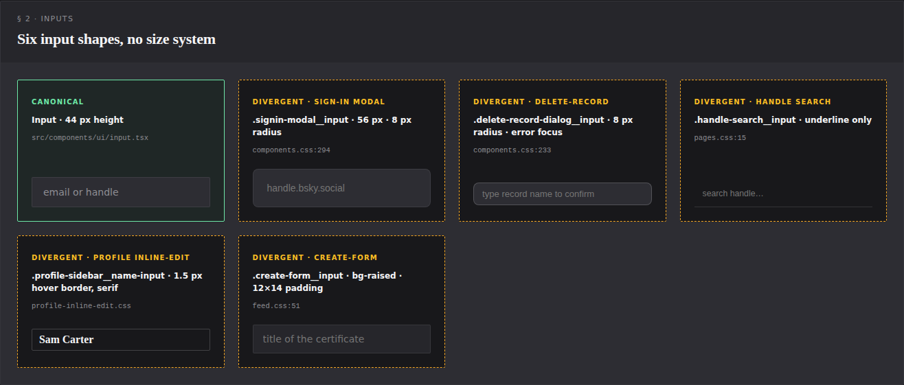

The 56 px sign-in input (top right of the canonical-and-friends row) is materially taller than the 44 px canonical Input. The handle-search input has no chrome at all — just an underline. The profile inline-edit input has a serif font and a 1.5 px hover-color border to signal "currently editable." Each one is justifiable in isolation, but five different input shapes for the same job is a maintenance tax.

The cleanest consolidation: give `<Input>` a `size` prop (`sm` / `md` / `lg`) and a `variant` prop (`default` / `underline` / `inline-edit`), then migrate sign-in and handle-search and profile inline-edit to use it.

**Maps to decision queue:** I1 (sizes), I2 (inline-edit variant), I3 (form padding).

---

## § 3 · Cards — two families, neither documented

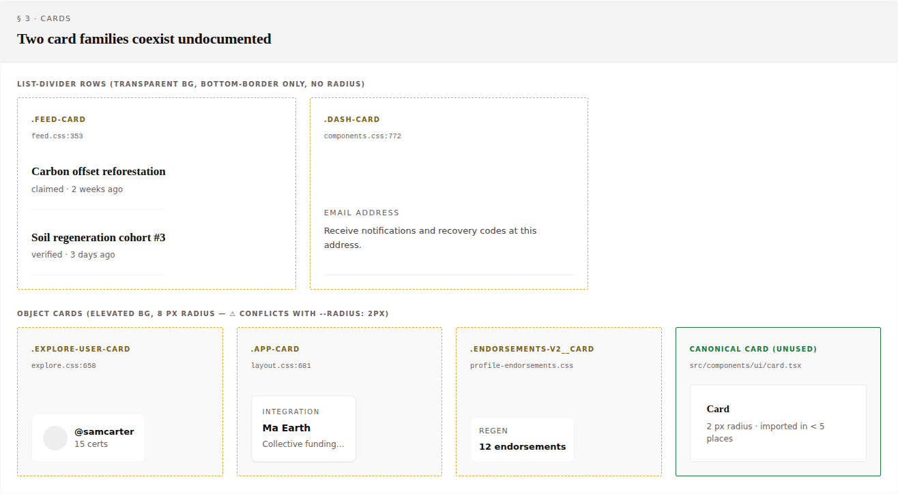
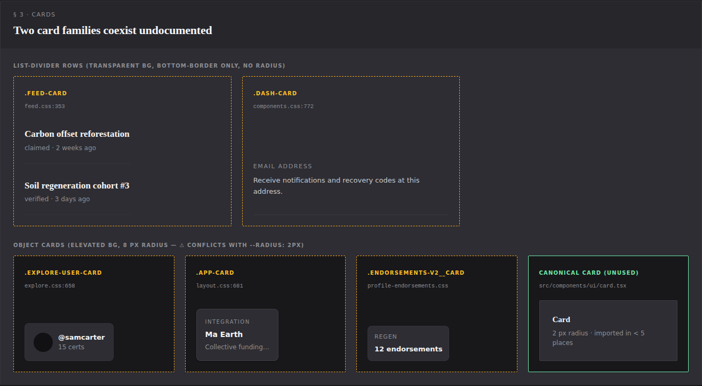

The composite makes the split obvious:

- **List-divider rows** (top): `.feed-card`, `.dash-card`. Transparent background, bottom border only, no radius. These are *rows*, not boxes.
- **Object cards** (bottom): `.explore-user-card`, `.app-card`, `.endorsements-v2__card`. Elevated background, **8 px radius**, full border. These are *boxes*.

The canonical `<Card>` (green, far right) is none of the above — it has the elevated background of an object card but the 2 px radius of the token system. It's also nearly unused.

**Action:** introduce `--radius-card: 8 px` as a real token if you want to keep the soft object-card look, OR force everything to `var(--radius)` (2 px). The current state — three sizes of card with three different radii, undocumented — is the actual problem.

**Maps to decision queue:** C1 (object-card radius token), C2 (extract shells).

---

## § 4 · Border-radius drift

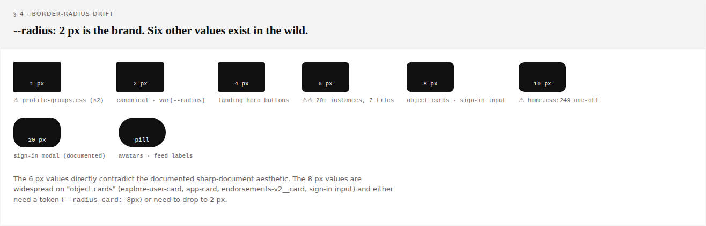
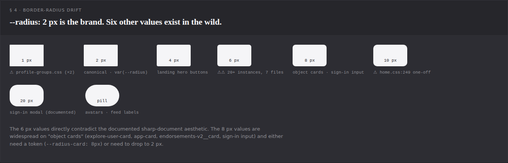

Eight different radii currently appear in the codebase. Two are unequivocally correct (`var(--radius)`=2 px and pill=999 px). The others:

- **1 px** — anomalous, 2 instances in `profile-groups.css`. Should be 2 or 0.
- **4 px** — landing hero buttons. Intentional brand divergence; document it.
- **6 px** — **20+ instances across 7 files**, contradicting the documented brand. Single biggest cleanup target.
- **8 px** — object cards + sign-in input. Either promote to `--radius-card` or push to 2 px.
- **10 px** — one-off (`home.css:249`). Just fix it.
- **20 px** — sign-in modal hero treatment. Documented exception; keep.

This category is the **highest-leverage Tier 1 fix** — a single search-and-replace on `6 px` restores brand sharpness across half the app in ~30 minutes.

**Maps to:** [component-audit.md §4.1](./component-audit.md#41-border-radius), [Tier 1 #1](./component-audit.md#tier-1--high-leverage-low-risk-single-commit-fixes).

---

## § 5 · Modals — three hand-rolled reuse AppDialog's classes but not its component

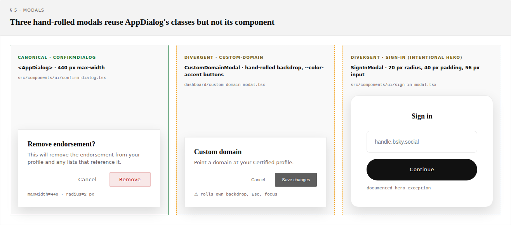
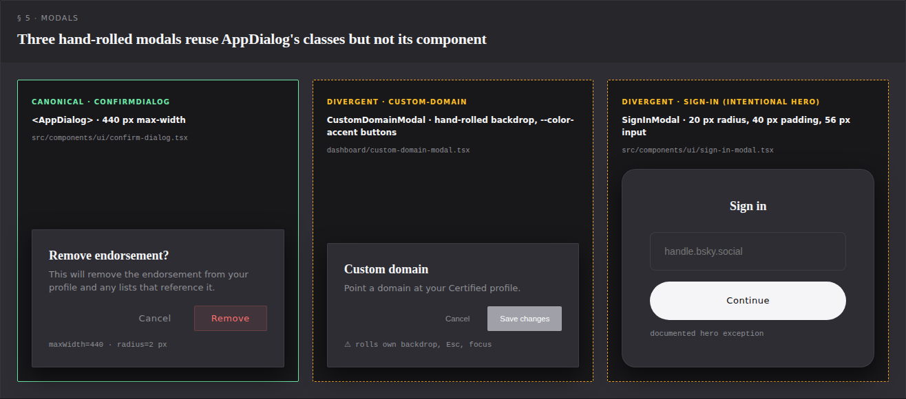

Left: a canonical `<AppDialog>`-based modal — 2 px radius, native `<dialog>` element, Esc / backdrop / focus restore handled by the wrapper.

Middle: `CustomDomainModal` — *looks* identical because it reuses the `.app-modal` CSS classes, but the React component hand-rolls the backdrop, Esc handling, focus trap, and body scroll lock. Same applies to `AddOrgModal` and `MembershipSyncModal`. The comment at `app-dialog.tsx:118` already documents an `InvalidStateError` regression caused by this exact class of bug — those three modals are running on borrowed time.

Right: `SignInModal` is intentionally a hero surface — 20 px radius, 40 px padding, 56 px input, pill-shaped submit button. Documented in DESIGN.md; keep separate.

**Action:** migrate the three hand-rolled modals to `<AppDialog>`. The visual result is identical because they're already using the same CSS; the safety improvement is significant.

**Maps to decision queue:** M1 (migration scope), M2 (SignInModal radius).

---

## § 6 · Badges — one component, four ad-hoc pill families

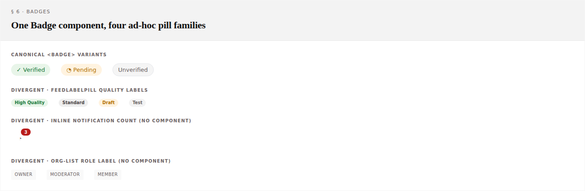
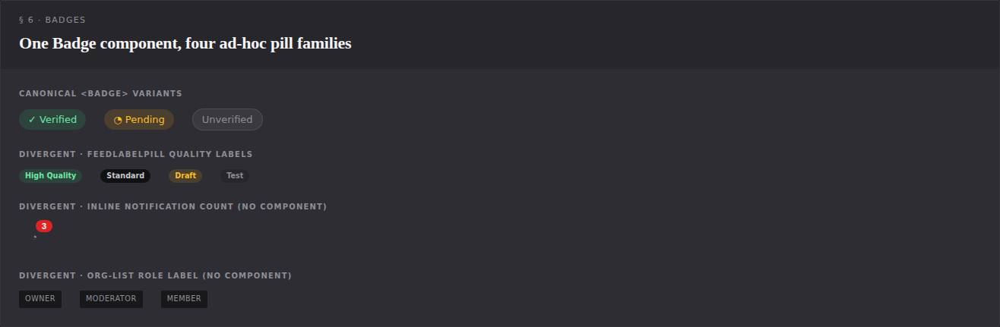

Top: the canonical `<Badge>` with its three variants. Below: three separate pill families that each look like they should be `<Badge>` variants but aren't:

- **FeedLabelPill** has its own component (`feed-label-pill.tsx`) but uses the `.feed-card__label` CSS family rather than going through `<Badge>`.
- **Notification count** has tokens (`--badge-count-bg/fg`) but no component — used inline in navbar.
- **Org-list role label** is pure CSS, no component.

All four pill families share the same essential geometry (rounded-full, small text, padding 4×8–12). Cleanest fix: extend `<Badge>` to absorb all of them, OR split into `<Badge>` (status: verified/pending/unverified) + `<Tag>` (neutral chip: count/role/quality/tag).

**Maps to decision queue:** Bdg1.

---

## § 7 · Elevation — three documented tiers + one ad-hoc fourth

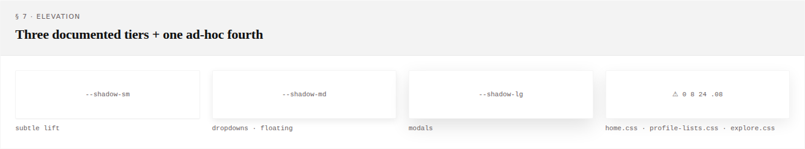
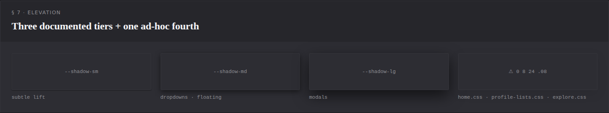

The three documented tiers (`--shadow-sm` / `--shadow-md` / `--shadow-lg`) are visible left-to-right. The far-right tile is the ad-hoc `0 8 24 .08` shadow that shows up in `home.css:206`, `profile-lists.css:359`, and `explore.css:83` — a "between md and lg" fourth tier that exists without a token.

Two choices:
- **Define `--shadow-xl`** and migrate the three sites to it (if you want the distinct depth).
- **Fold to `--shadow-md`** (if you don't — they're visually close).

Either way, the raw `rgba(0,0,0,0.08)` shouldn't be in component CSS.

**Maps to:** [component-audit.md §4.4](./component-audit.md#44-elevation).

---

## § 8 · Typography — legal pages bypass the canonical heading scale

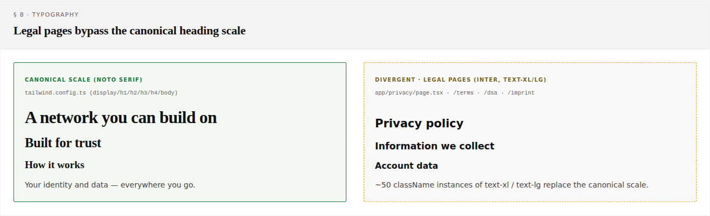
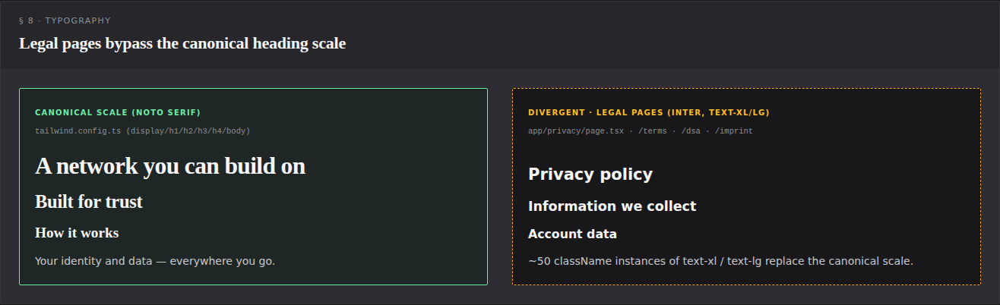

Left: the canonical scale — Noto Serif headlines, the precise letter-spacing and line-height tokens from `tailwind.config.ts`. This is the brand voice ("notary's ledger") that DESIGN.md describes.

Right: the legal pages (`/privacy`, `/terms`, `/dsa`, `/imprint`). Inter sans-serif everywhere, `text-xl` / `text-lg` instead of `text-h1` / `text-h2`. The typographic feel is materially different — no serif anchor, no editorial weight. ~50 className instances across four files; a one-hour migration restores brand consistency on a surface that's actually visible (privacy/terms get traffic from sign-up flows and footer links).

**Maps to:** [component-audit.md §4.2](./component-audit.md#42-typography), [Tier 1 #2](./component-audit.md#tier-1--high-leverage-low-risk-single-commit-fixes).

---

## How to regenerate this sheet

```bash
# 1. Edit docs/design-audit/divergence-sheet.html (purely visual; no deps).
# 2. Re-capture:
node scripts/capture-divergence-sheet.mjs
# Outputs land in docs/design-audit/divergence/.
```

The HTML is self-contained — tokens are inlined, divergent class CSS is copied verbatim. No dev server required; the capture script renders `file://` directly.

## Files

| File | Purpose |
| --- | --- |
| [`divergence-sheet.html`](./divergence-sheet.html) | The source — open in any browser to inspect. |
| [`scripts/capture-divergence-sheet.mjs`](../../scripts/capture-divergence-sheet.mjs) | Playwright capture (light + dark, full-page + per-section). |
| [`divergence/_full_light.png`](./divergence/_full_light.png), [`_full_dark.png`](./divergence/_full_dark.png) | Full composites. |
| [`divergence/0X-*-{light,dark}.png`](./divergence/) | Per-section crops, embedded above. |
